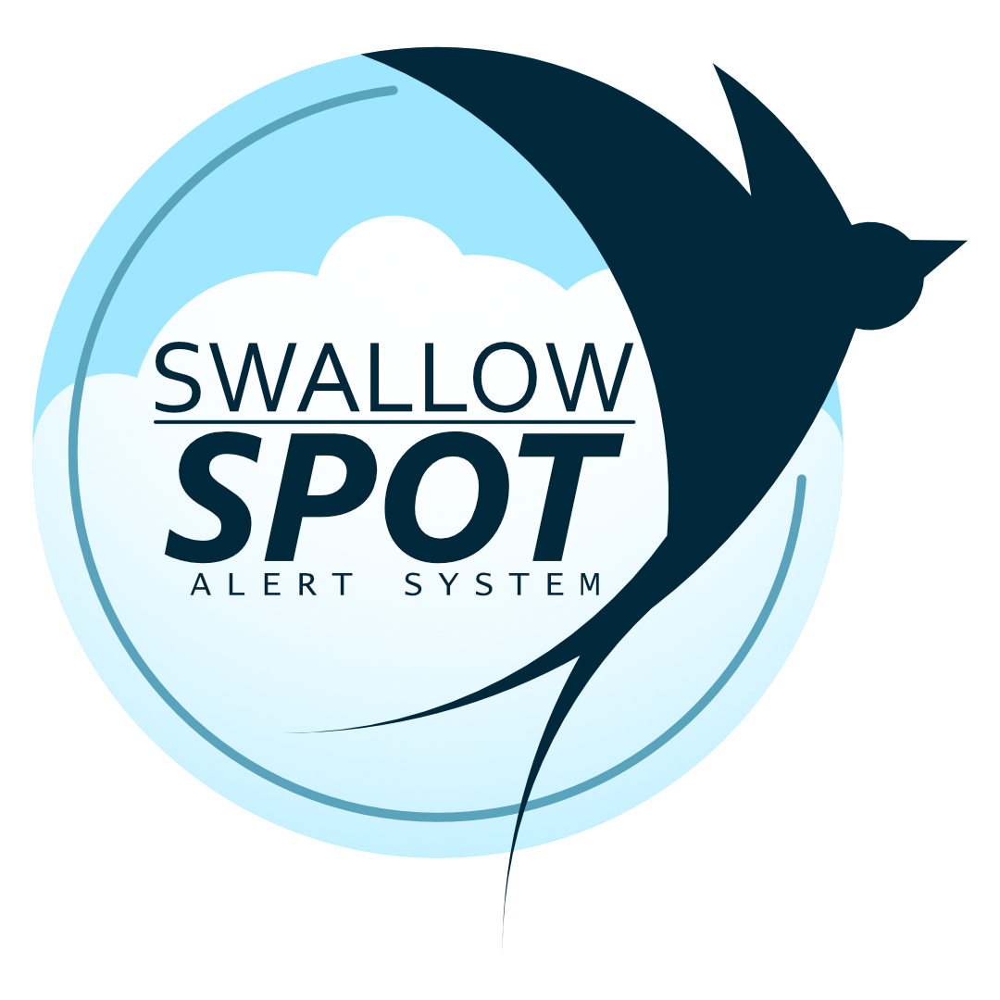
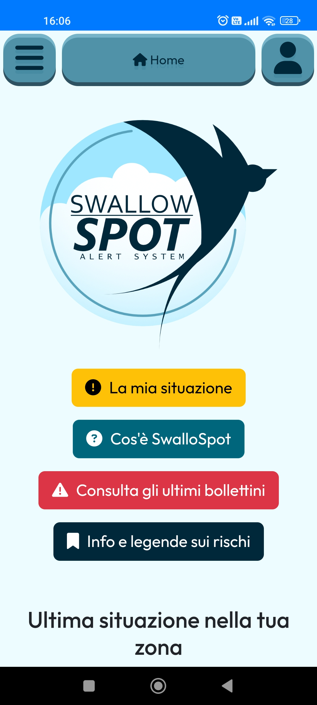
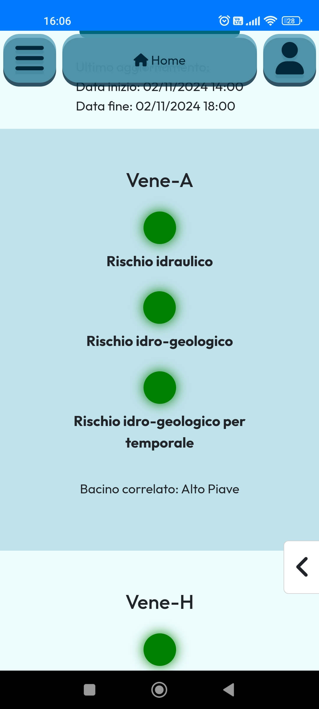
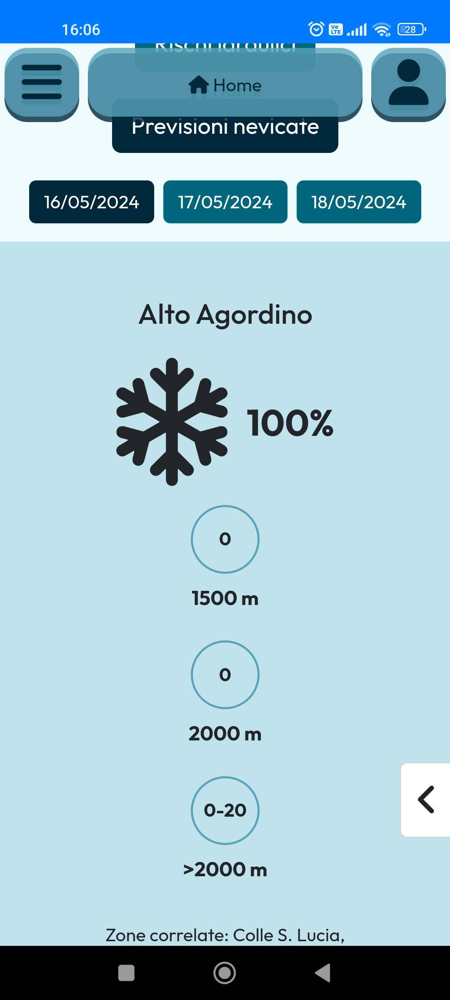
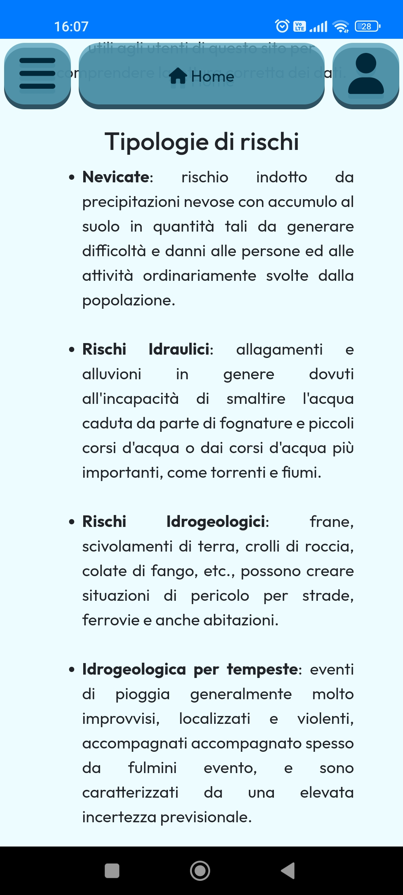

# SwallowSpot
---
# Introduction

Welcome to **SwallowSpot**!

The ideal place to obtain updated information about the weather conditions in the Veneto Region.

This site will be your reference point for accessing the official weather bulletins published by the region, ensuring a clear and comprehensive view of forecasts and any alerts in place.

The site monitors various types of weather situations that can impact the Veneto territory, including **snowfall**, **hydraulic** and **hydrogeological** situations, as well as specific alerts related to **thunderstorms**.

Thanks to the classification into four distinct colors - **Green**, **Yellow**, **Orange**, and **Red** - the level of risk associated with each situation can be immediately assessed.

# Screenshots

  
  
  
  

# Licensing

## Code

The code in this project is licensed under the GNU General Public License v3.0. See the [LICENSE](./LICENSE) file for details.

## Assets

The assets in this project (including images, graphics, audio, etc.) are licensed under Attribution-NonCommercial-NoDerivatives 4.0 license. See the [LICENSE-ASSETS](./LICENSE-ASSETS) file for details.

# Documentation

The technical documentation is available in both [Italian](./docs/doc_it.md) and [English](./docs/doc_eng.md) in the [docs](./docs/) folder.

# Developers

*This project involved: [Degetto Tommaso][1], [La Rosa Leonardo][2], [Maggiotto Giacomo][3], [Martini Davide][4], [Stefani Marco][5], [Tosin Filippo][6].*

[1]: https://github.com/Deggi0
[2]: https://github.com/le0o5
[3]: https://github.com/JackGiotto
[4]: https://github.com/Davidem298
[5]: https://github.com/Wend19
[6]: https://github.com/FilippoTosin
